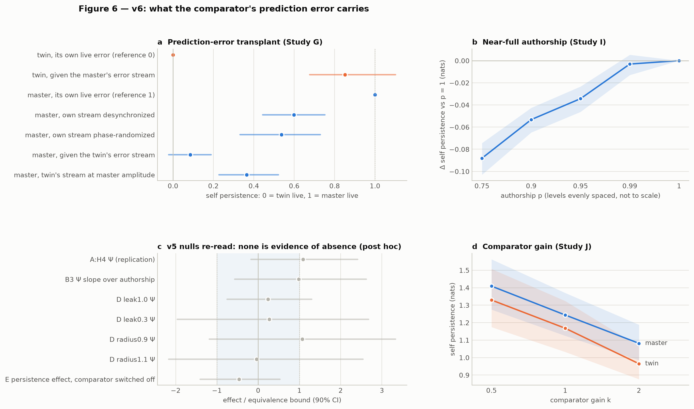
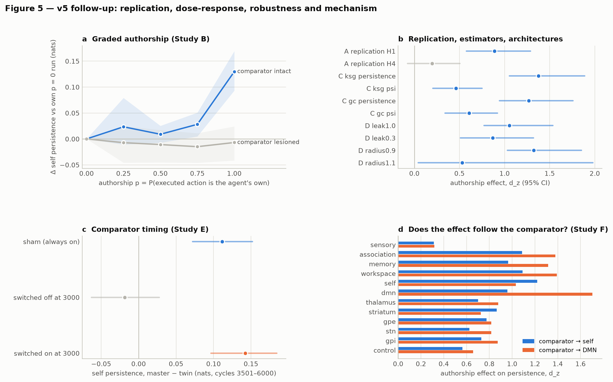

# Ghost in the Machine — preregistered experiments on authorship and self-model dynamics

**What does it take for a synthetic agent's self-model to be stabilized by acting? Preregistered, null-calibrated, replicated.**

Author/project lead: **Kai Piper** · Version **6.0** (v4 laboratory, v5 follow-up, v6 mechanism) · 27 September 2026

> **Scientific status.** This is a synthetic computational experiment. It does **not** create, detect, measure or prove phenomenal consciousness in any system. "GHOST-v4" names a preregistered conjunction of statistical results in a simulated network, and nothing more.

## Current state of the evidence (after v6)

In this model, the comparator feeds the population it targets a prediction-error signal (what happened minus what was predicted), and that input shakes the population's slowest collective mode. **When the agent authors its own actions, the error it receives is smaller, gentler in spectrum and in step with its own state, so the slow mode is shaken less.**

v6 showed this causally by transplanting error streams:
- An author given a non-author's stream loses almost the whole advantage (0.08 of the way from twin to master).
- A non-author given the author's stream recovers most of it (0.85).
- Desynchronizing the author's own stream, with identical values and spectrum, removes 40% of the advantage. The preregistered noise-only ("amplitude") explanation predicted no loss at all.

Two earlier claims were revised:
- The dose-response is not a threshold at exactly 100% authorship: 5% foreign actions cost persistence, 1% does not.
- The v5 verdict that causal emergence (Ψ) "did not replicate" was too strong. A post-hoc meta-analysis across all five independent samples finds a modest, variable Ψ effect.

Every number in the table below is checked in CI against the results file it comes from (`tools/claims.py`). Retracted and unreplicated claims stay in the ledger ([`docs/CLAIMS.md`](docs/CLAIMS.md)).

<!-- claims:start (generated by tools/claims.py; edit claims/claims.json) -->

| claim | introduced | status | evidence |
|---|---|---|---|
| v3's sustained 'cross-theory' event is an emergent self-model regime | v3.0 | **retracted** | fires in 0.92 of master runs but also 0.75 of twins that never author their actions; persistence equals detector hysteresis in 1.00 of firing runs; gain cap reached in 0.96 of runs |
| **Authoring one's own actions makes the slow collective mode of the self-model population more persistent** | v4.0 | **replicated** | d_z 1.21 (v4, 48 networks) → 0.89 (replication, 48 new networks); KSG estimator 1.38; pooled over 5 independent samples / 192 networks: +0.134 nats [0.115, 0.152], I² 0.00 (post hoc) |
| **The authorship effect is carried by the comparator's prediction-error stream** | v6.0 | **supported** | an author given a non-author's error stream falls to 0.08 of the way from twin to master (G1 d_z 1.02); a non-author given the author's stream rises to 0.85 (G2 d_z 0.99) |
| **It is not only noise amplitude: the error must be in step with the network's own state** | v6.0 | **supported** | desynchronizing the author's own stream (identical values and spectrum) keeps only 0.60 of the effect (G3 d_z 0.64); rescaling the twin's stream to author amplitude lifts 0.08 to 0.36 (G4 d_z 1.19) |
| The comparator perturbs the slow mode; authorship makes the perturbation smaller and better timed | v6.0 | **supported** | silencing the comparator raises master persistence from 1.12 to 1.46 nats (twin: 0.98 → 1.48); both fall as the comparator gain rises (master d_z -1.28, twin d_z -1.64) |
| The effect depends on the efference-copy/comparator loop | v4.0 | **replicated** | comparator interaction d_z 0.54 (v4) → 0.75 (replication); dose-response needs the comparator, d_z 0.62 |
| The effect is specific to the 'self' population | v4.0 | **revised** | self-specificity d_z 0.84 (v4); rerouting the comparator to DMN moves the peak there (DMN d_z 0.96 → 1.70; shift d_z 1.26) |
| Authorship increases causal emergence of the self (Rosas Ψ) | v4.0 | **revised** | d_z 0.59 (v4) → 0.20 in the preregistered replication (p 0.097); 0.55 in v6 Study G (secondary); pooled over 5 samples: +0.129 [0.077, 0.181], I² 0.20; the replication cannot rule out d_z 0.18 (small telescopes) |
| Preregistered verdict level 4 (GHOST-v4) | v4.0 | **not replicated** | level 4 in the v4 sample; level 3 in the preregistered replication; single-sample verdicts are noisy (see the Ψ entry) |
| Authorship increases the nonlinear arrow of time of the network dynamics | v4.0 | **replicated** | d_z 0.44 (v4) → 0.58 (replication) |
| Master and twin can be told apart blind, from the network dynamics alone | v4.0 | **replicated** | AUC 0.69 (v4) → 0.79 (replication); placebo master-vs-master AUC 0.50 |
| The effect grows with the degree of authorship | v5.0 | **supported** | per-network slope d_z 0.76, comparator-dependent (d_z 0.62) |
| The dose-response is a threshold at exactly full authorship | v5.0 | **revised** | 5% foreign actions cost 0.034 nats (I1 d_z 0.83); 1% cost nothing detectable (I2 d_z 0.09); foreign actions degrade even own-action predictions (I3 d_z 2.39) and persistence tracks the prediction error within networks (I4 d_z -2.55) |
| The effect survives other unit and coupling settings | v5.0 | **supported** | leak 1.0: d_z 1.05; leak 0.3: 0.87; radius 0.9: 1.32; radius 1.1: 0.53 |
| The effect is online: it exists while the comparator signal arrives | v5.0 | **supported** | appears when the comparator is switched on mid-run (d_z 1.28); disappears when switched off (d_z 0.83); residual when off at most +0.021 nats (90% CI upper bound) |
| The authorship effect grows with the comparator's gain | v6.0 | **open** | not supported (J2 d_z 0.16); the effect at half gain misses Holm (J1 p 0.052), though at least 21/24 networks go in the predicted direction at every gain; two networks with near-frozen twins dominate the means |

<!-- claims:end -->

Reports: [v6](paper/Ghost_in_the_Machine_v6_Mechanism.md) · [v5](paper/Ghost_in_the_Machine_v5_Followup.md) · [v4](paper/Ghost_in_the_Machine_v4_Paper.md). All numbers: [`results/v6/SUMMARY_v6.md`](results/v6/SUMMARY_v6.md), [`results/v5/SUMMARY_v5.md`](results/v5/SUMMARY_v5.md), [`results/v4/SUMMARY.md`](results/v4/SUMMARY.md).





## v4 in one paragraph

v3 reported a sustained, spontaneous "cross-theory" event and a surrogate test it could not pass. v4 first **re-adjudicates v3**, with its code unchanged. The event turns out to be mostly a homeostatic gain ramp measured against an early baseline and held on by detector hysteresis. It fires almost as often in a twin that never authors its actions, and most of v3's evidence channels cannot, by construction, tell real dynamics from shuffled ones. v4 then replaces convergence-of-proxies with **contrasts**. The same network is run closed-loop and as a **cross-yoked twin** that receives an equivalent sensory/action stream it did not author. Each metric is tested against a **ladder of null models**, and false-positive rate and power were **measured on ground-truth systems first**. Everything ran under a **cryptographically locked preregistration** that was pushed before any confirmatory seed. On 48 held-out networks in 4 held-out worlds, authorship made the slowest collective mode of the agent's self-model population more persistent (d_z = 1.21, in 44 of 48 networks). The effect was strongest in the self population, vanished when the efference copy or the comparator was lesioned, and was detectable blind from the dynamics alone. By the preregistered ladder this is **GHOST-v4**, with bounds stated below. Its Ψ component then missed in the preregistered replication; pooled over all later samples it is a modest, variable effect (see above).

## v4 headline results (original confirmatory sample)

| | result |
|---|---|
| **v3 re-adjudicated** (24 fresh seeds, v3 code unchanged) | event in 22/24 runs, **but** in 18/24 cross-yoked twins and 18/24 frozen-learning runs; clamping the gain cuts it to 10/24 (0.91) and 9/24 (1.18), McNemar p ≤ 0.0005 |
| v3 "persistence" | equals detector hysteresis in 100% of firing runs; switch-off condition met in **0%** of windows (120 runs) |
| v3 evidence channels | 7.2 of 10 votes pass in ≥ 95% of windows ("free votes"); zero-lag metrics sit on top of their shuffle nulls; **no** v3 metric shows nonlinear temporal structure |
| **v4 manipulation check** | network→world transfer entropy higher in master than twin, d_z = 0.71 |
| **H1** authorship → self persistence | +0.140 nats, **d_z = 1.21** [0.89, 1.73] |
| **H2** self-specific | self − other populations, d_z = 0.84 |
| **H3** comparator-dependent | effect vanishes with comparator lesioned (interaction d_z = 0.54); also vanishes without efference copy |
| **H4** authorship → causal emergence (Rosas Ψ) | d_z = 0.59; the macro term rises (d_z 1.21) while the parts' term does not (d_z −0.10) |
| **H5** integration Φ_R · **H7** arrow of time | d_z 0.39 · 0.44 |
| **H6** nonlinear arrow of time | z ≈ 88 above multivariate-phase surrogates |
| placebo A/A (same network, new noise) | all 5 contrasts null; blind classifier at chance (AUC 0.52) |
| blind master vs twin from dynamics alone | AUC **0.69** (null 95th pct 0.56) |
| **Verdict (preregistered ladder)** | **level 4 — GHOST-v4** in this sample; **level 3 on replication** (v5 Study A) |

**What it means:** in this model, authorship stabilizes a *world-coupled* self through the efference-copy/comparator loop, the dynamical signature of the comparator model of agency.

**What it does not mean:** not experience; not "more emergent is better" (a self *disconnected* from its actions' consequences was the most persistent of all); not strong emergence (downward causation fell); not "the twin is just more surprised" (effect size does not track excess prediction error); not exclusive to the self population (six others show smaller effects; v5 showed the peak follows the comparator's wiring). Full discussion: [`paper/Ghost_in_the_Machine_v4_Paper.md`](paper/Ghost_in_the_Machine_v4_Paper.md). Every number: [`results/v4/SUMMARY.md`](results/v4/SUMMARY.md).


## Quick start

Python 3.10+ with NumPy and Matplotlib. The entry points install them if they are missing, as v1–v3 did. Alternatively, `pip install -e ".[test]"` installs the packages and the `ghost-v4`, `ghost-v5` and `ghost-v6` commands.

```bash
# one closed-loop agent and its cross-yoked twin (~10 s)
python src/ghost_in_the_machine_v4.py demo

# the full preregistered pipeline: calibration, v3 forensics, 48-network campaign, analysis, figures
python src/ghost_in_the_machine_v4.py all --out results/v4 --workers 4      # ~35 min on 4 cores

# post-hoc analyses (not preregistered; labelled as such)
python src/ghost_in_the_machine_v4.py posthoc --out results/v4

# v5 follow-up studies (replication, dose-response, estimators, architectures, timing, rerouting; ~30 min)
python src/ghost_in_the_machine_v5.py verify
python src/ghost_in_the_machine_v5.py run --study all && python src/ghost_in_the_machine_v5.py analyze && python src/ghost_in_the_machine_v5.py report

# v6 mechanism studies (prediction-error transplant, near-full authorship, comparator gain; ~10 min)
python src/ghost_in_the_machine_v6.py verify
python src/ghost_in_the_machine_v6.py run --study all && python src/ghost_in_the_machine_v6.py posthoc \
  && python src/ghost_in_the_machine_v6.py analyze && python src/ghost_in_the_machine_v6.py report

# tests (50, ~1 min) and the claims ledger
python -m pip install pytest && python -m pytest
python tools/claims.py check
```

To review, attack or independently replicate the results, see [`docs/HOW_TO_REVIEW_OR_REPLICATE.md`](docs/HOW_TO_REVIEW_OR_REPLICATE.md).

Individual stages:

```bash
python src/ghost_in_the_machine_v4.py calibrate                  # instrument calibration on ground-truth systems
python src/ghost_in_the_machine_v4.py v3-forensics               # re-adjudicate v3 (24 seeds x 5 conditions)
python src/ghost_in_the_machine_v4.py campaign --phase dev       # exploratory development seeds
python src/ghost_in_the_machine_v4.py verify                     # does the preregistration lock still verify?
python src/ghost_in_the_machine_v4.py campaign --phase confirm   # labels output CONFIRMATORY only if the lock verifies
python src/ghost_in_the_machine_v4.py analyze                    # preregistered tests, verdict, results_v4.json, SUMMARY.md
python src/ghost_in_the_machine_v4.py report                     # figures
```

Windows: `run_v4_demo.bat`, `run_v4.bat`. Linux/macOS: `./run_v4.sh`. v3 is byte-identical to its validated build and still runs as before (see *Previous versions*).

## How v4 works

**Agent** (`src/ghost_v4/engine.py`). This is v3's 12-population cortico-thalamo-basal-ganglia motif and latent world, with changes each motivated by the forensic audit or by a mechanistic hypothesis:
- a fixed effective spectral radius (no gain ramp);
- leaky rate units;
- an **efference copy** of each motor command, sent to the forward models and to the control and self populations;
- a **comparator** that feeds predicted-vs-actual sensory mismatch back into the self population;
- self-surprise feedback;
- full trajectory recording, so that every metric is a pure function of the record.

It is about 7× faster than v3.

**Cross-yoked twin.** The same network, in the same world, receives cycle by cycle the observations and executed actions recorded from another network's closed-loop run. It still forms intentions, sends efference copies, runs its comparator and learns. Its intentions just no longer cause what it senses: intention/outcome agreement falls to chance (1/7) and counterfactual agency to 0.5. This is the yoked-control design, a computational analogue of the contrastive method.

**Lesions and placebo.** Comparator, efference copy, self-feedback and learning are each removed from both master and twin, so each lesion's effect is tested as an authorship × lesion interaction. Each master is also re-run with fresh noise (an A/A placebo).

**Metrics and their "kinds"** (`metrics.py`, `infotheory.py`, `temporal.py`):
- self persistence (lag-1 information of a population's maximum-autocorrelation linear feature);
- Rosas et al. Ψ, Δ and Γ;
- pairwise Φ_R;
- informational closure (NTIC, dynamical dependence);
- ordinal-pattern time irreversibility and Q3 asymmetry;
- lagged asymmetry, participation ratio, functional connectivity and multiscale entropy;
- a PCI-like probe.

Each metric is tagged by the structure it can read: zero-lag, univariate-temporal, lagged-linear or nonlinear-temporal. The tag fixes in advance which nulls it could possibly beat.

**Null ladder** (`surrogates.py`):

| rung | preserves | destroys |
|---|---|---|
| L0 shuffle | marginals, zero-lag covariance | temporal order |
| L1 channel-wise IAAFT | each channel's spectrum + amplitudes | coordination, nonlinearity |
| L2 multivariate phase randomization | all auto/cross spectra | nonlinear temporal structure |
| L3 VAR(2) | linear dynamics | nonlinear, non-Gaussian structure |
| L4 cross-yoked twin | network, world, stream statistics, learning | authorship |

**Instrument calibration** (`controls.py`). False-positive rate and power are measured on four ground-truth systems before any claim is made. This exposed two traps:
- under Gaussian estimation Rosas' Ψ is *positive* for completely independent parts and *negative* for a coordinated flock;
- FFT surrogates make linear lag statistics "significant" (|z| up to ~230) through an O(1/T) end effect.

A 1% smallest-effect-size rule removes the second trap: post-hoc, the ceiling false-positive rate goes from 20–25% to 0% with power unchanged.

**Preregistration and blinding** (`prereg/`, `prereg.py`, `campaign.py`). The analysis plan and the 12 source files that can change a confirmatory number are SHA-256-locked. The lock commit was pushed before the confirmatory run, and the runner refuses to label output CONFIRMATORY unless the lock verifies. Runs are stored under random codes, and the unblinding key lives in a separate file.

## Repository layout

```text
src/
  ghost_in_the_machine_v4.py     entry point (CLI)
  ghost_v4/
    engine.py                    v4 agent: efference copy, comparator, cross-yoked twin, lesions
    infotheory.py                Gaussian MI/CMI/TE, Rosas Ψ/Δ/Γ, pairwise Φ_R, closure, MAF macro
    temporal.py                  arrow-of-time statistics, LZ76
    surrogates.py                the null ladder L0–L3
    metrics.py                   observational panel; metric kinds and predicted ceilings
    controls.py                  ground-truth systems for calibration
    stats.py                     surrogate p, sign-flip tests, effect sizes, bootstrap, Holm/BH
    classifier.py                leave-one-seed-out discrimination with permutation nulls
    campaign.py                  orchestration, coded storage, preregistered analysis
    v3_bridge.py                 runs the frozen v3 file with recording and controls
    prereg.py                    cryptographic preregistration lock
    posthoc.py                   post-hoc (not preregistered) analyses
    report.py, figures.py, cli.py, _bootstrap.py
  ghost_in_the_machine_v5.py     v5 entry point
  ghost_v5/                      v5 studies: engine (bit-identical to v4 at defaults) with graded authorship,
                                 comparator schedule and rerouting; KSG and Gaussian-copula estimators;
                                 study runners and analyses; lock; report
  ghost_in_the_machine_v6.py     v6 entry point
  ghost_v6/                      v6 studies: engine (bit-identical to v5 at defaults) with a replaceable
                                 prediction-error channel (replay, transplant, desynchronize, phase-randomize,
                                 rescale) and comparator gain; TOST equivalence; study runners and analyses;
                                 lock; post-hoc re-reading of v5 nulls; living meta-analysis; report
  ghost_in_the_machine_v3.py     v3, byte-identical to the validated build
prereg/                          v4, v5 and v6 preregistrations, replication prereg, and their locks
claims/claims.json               the claims ledger: every claim, its status and the data behind each number
results/v4/                      SUMMARY.md, results_v4.json, pipeline.log,
                                 calibration/, v3_forensics/, campaign/, dev_campaign/, posthoc/
results/v5/                      SUMMARY_v5.md, results_v5.json, per-study coded runs (A–F)
results/v5_pilot/                v5 technical pilot (development networks)
results/v6/                      SUMMARY_v6.md, results_v6.json, per-study coded runs (G, I, J),
                                 posthoc_v5_equivalence.json, pipeline.log
results/v6_pilot/                v6 technical pilot (development networks)
results/final_validation/        v3 validation run (unchanged)
figures/                         ghost_v6_figure_6_*.png, ghost_v5_figure_5_*.png, ghost_v4_figure_{1..4}_*.png, ghost_v3_figure_{1..3}_*.png
paper/                           v6 mechanism report, v5 follow-up report, v4 paper, v3 paper (md, docx, pdf)
.github/workflows/tests.yml      CI: tests, all lock verifications and the claims check on Linux and Windows
pyproject.toml                   editable install with the ghost-v4/v5/v6 commands
docs/REVIEW_OF_V3_ASSESSMENT.md  point-by-point review of an external assessment of v3
docs/HOW_TO_REVIEW_OR_REPLICATE.md  guide for reviewers and independent replicators
docs/CLAIMS.md                   the rendered claims ledger
tests/                           estimator ground-truth tests, pipeline tests, v5/v6 engine identity tests, ledger tests
tools/claims.py                  checks every ledger number against its results file; renders the README table
tools/export_paper.py            Markdown → DOCX (pandoc) and PDF (headless Chromium)
legacy/                          v1, v2
```

## Interpretation, stated three ways

1. **Observed.** In 48 held-out synthetic networks, authoring actions increased the persistence of the self population's slowest collective mode. That increase lived in the collective mode rather than in the parts, depended on the efference-copy/comparator loop, and was detectable blind. All preregistered tests passed; all placebo contrasts were null. In a preregistered replication on 48 new networks, everything except the Ψ (emergence) component replicated; Ψ is positive but modest and variable when all five independent samples are pooled. v6 showed the persistence effect is carried by the comparator's prediction-error stream.
2. **Supported computational interpretation.** In this architecture, the comparator couples a population to the consequences of action by injecting prediction errors, and those errors shake the population's slow dynamics. An author's errors are smaller, spectrally gentler and in step with its own state, so they shake it less. This holds online and wherever the comparator projects (v6 transplant, v5 timing and rerouting).
3. **Not supported.** That the program is conscious, has experiences or a self in any philosophical sense, or that this model says anything about any person or clinical condition.

## Previous versions

### v3.0 — long-run causal emergence / mesocircuit laboratory

A 12-population recurrent agent with learned world and self models, counterfactual agency, criticality, topology, complexity and mesocircuit metrics, and a 10-channel, 8-of-10 "GHOST-v3" gate. Its validation run (seed 17, 5,000 cycles) produced an event at cycle 1,600 and a failed surrogate test; both are preserved in `results/final_validation/` and `paper/Ghost_in_the_Machine_v3_Paper.md`. v4's forensic re-adjudication (above, and paper Section 2) explains both. The v3 file is unchanged (SHA-256 in `docs/SHA256SUMS.txt`) and still runs:

```bash
python src/ghost_in_the_machine_v3.py --steps 5000 --calibration-steps 1000 --diagnostic-interval 50 \
  --perturb-interval 500 --print-every 500 --skip-ablations --skip-recovery --no-plots --output results/my_validation
```

### v2.0 and v1.0

v2 removed v1's scripted self-model phase and added learned recurrent modules, predictive coding, metacognition, PCI-like probes and ablations. v1 was a 100-cycle conceptual prototype with an engineered transition. Both are in `legacy/`.

## Research context

- Cogitate Consortium et al. (2025), *Nature* 642:133–142 — adversarial testing of GNWT and IIT. DOI: 10.1038/s41586-025-08888-1
- Rosas et al. (2020), *PLoS Comput Biol* 16:e1008289 — information-theoretic causal emergence (Ψ, Δ, Γ).
- Mediano et al. (2022), *Chaos* 32:013115 — revised integrated information Φ_R.
- Frith, Blakemore & Wolpert (2000), *Phil Trans R Soc B* 355:1771 — comparator model of agency.
- Sanz Perl et al. (2021), *PRE* 104:014411; de la Fuente et al. (2023), *Cereb Cortex* 33:1856 — time irreversibility and consciousness.
- Chang, Biehl, Yu & Kanai (2020), *Front Psychol* 11:1504 — information closure theory.
- Barnett & Seth (2023), *PRE* 108:014304 — dynamical independence.
- Theiler et al. (1992); Schreiber & Schmitz (1996); Prichard & Theiler (1994) — surrogate data.
- Toker et al. (2026), *Nat Neurosci* 29:964–977; Maschke et al. (2024), *Commun Biol* 7:946 — the v3 inspirations.

## Reproducibility

- Preregistration locked 2026-09-27T12:48:56Z (`prereg/PREREGISTRATION_v4.lock.json`); `python src/ghost_in_the_machine_v4.py verify` checks it.
- v5 hypotheses committed before any v5 data (`7452b44`); v5 lock 2026-09-27T14:57:16Z (`prereg/PREREGISTRATION_v5.lock.json`, commit `5c38075`); `python src/ghost_in_the_machine_v5.py verify` checks it.
- v6 hypotheses committed before any v6 data (`e7da0f1`); v6 lock 2026-09-27T15:54:13Z (`prereg/PREREGISTRATION_v6.lock.json`, commit `88b10c2`, pushed before the confirmatory run); `python src/ghost_in_the_machine_v6.py verify` checks it.
- `python tools/claims.py check` verifies every headline number against its results file (also run in CI).
- `.gitattributes` disables line-ending conversion so these SHA-256 checks also pass on Windows checkouts.
- Source hashes: `docs/SHA256SUMS.txt`.
- The pipeline is deterministic given seeds; only the random run codes in `runs_coded.json` differ between re-runs.
- Development (exploratory) and confirmatory results are kept separate: `results/v4/dev_campaign/` vs `results/v4/campaign/`.
