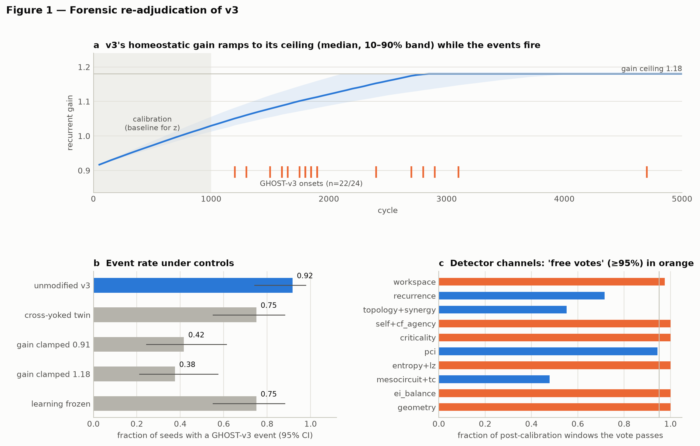
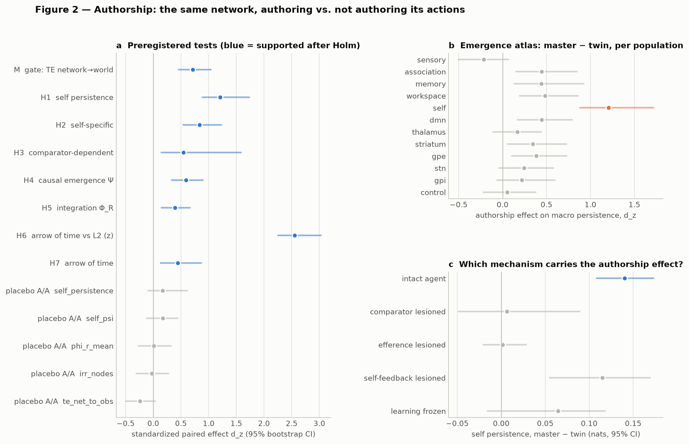
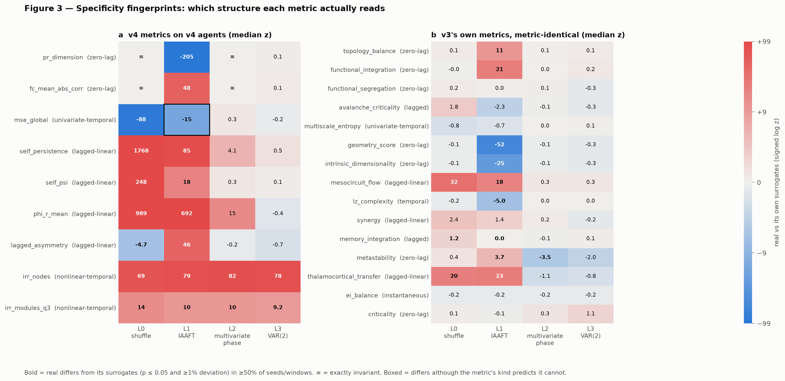
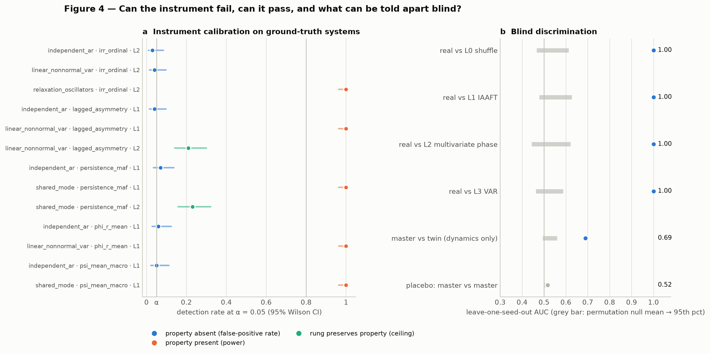

# Ghost in the Machine v4: Authorship, Emergence and Specificity — a Preregistered, Null-Calibrated Test of a Synthetic Self

**Kai Piper**
27 September 2026

> **Scientific status.** This is a synthetic computational experiment. It does not create, detect, measure or prove phenomenal consciousness in any system. "GHOST-v4" is the name of a preregistered conjunction of statistical results in a simulated network.

## Abstract

*Ghost in the Machine* v3 reported a sustained, spontaneous "cross-theory" event in a recurrent self/world-modelling agent, together with a failed surrogate test. We first re-adjudicate v3 with its source code unchanged. On 24 fresh seeds the event fired in 22/24 runs. Its timing is explained by a homeostatic gain ramp chasing an unreachable target, measured against an early calibration baseline. Clamping the gain at either end of the ramp cut the event rate to 10/24 and 9/24 (exact McNemar p ≤ 0.0005). The event still fired in 18/24 cross-yoked twins that never author their actions. Its "persistence" equalled the detector's hysteresis in every run: the switch-off condition was met in 0% of windows. Seven of its ten evidence channels were effectively always on. Re-evaluating v3's own metric code on surrogate data (metric-identical to 10⁻⁹) shows that its zero-lag metrics cannot distinguish real dynamics from a temporal shuffle, and that none of its metrics detects nonlinear temporal structure.

v4 then asks three narrower questions, each of which can fail: does a self-level macro-variable depend on the agent **authoring** its actions (A); is that dependence **specific** to the self population, to a mechanism, and to structure that survives calibrated nulls (S); and does authorship increase the **causal emergence** of the self-variable (E)? The new agent adds an efference copy, a comparator and self-surprise feedback, removes the gain ramp, and records its full trajectory. Each network is compared with itself as a *cross-yoked twin*, which receives another network's observation and action stream in the same world, and with a placebo replicate. Metrics are tagged by the structure they can read and tested against a four-rung null ladder (shuffle, IAAFT, multivariate phase randomization, VAR). Before any claim, false-positive rate and power were measured on ground-truth systems. Two traps were exposed: Gaussian Rosas Ψ is positive for completely independent parts, and FFT surrogates make linear lag statistics "significant" through an O(1/T) end effect. The analysis was preregistered and cryptographically locked, and the lock was pushed before any confirmatory run.

On 48 held-out networks in 4 held-out worlds, all preregistered tests passed. Authorship increased the persistence of the self population's slowest collective mode (d_z = 1.21), most strongly in the self population (d_z = 0.84 vs the other populations), and only with the comparator intact (interaction d_z = 0.54). The effect also vanished without an efference copy. Authorship increased Rosas' Ψ for the self-variable (d_z = 0.59) because the collective term rose while the parts' term did not. It modestly increased integration (Φ_R, d_z = 0.39) and a strongly nonlinear arrow of time (d_z = 0.44; z ≈ 88 above linear surrogates). All placebo contrasts were null, and a blind classifier distinguished master from twin from neural dynamics alone (AUC = 0.69). By the preregistered ladder this is **GHOST-v4**. Its meaning is bounded: a self disconnected from its actions' consequences was *more* persistent than any authored self, downward causation fell, and the effect was not predicted by the amount of extra surprise the twin experienced. In this model, authorship stabilizes a world-coupled self through the comparator loop. That is a mechanistic, falsifiable result, not a claim about experience.

**Keywords:** sense of agency; comparator model; efference copy; yoked control; causal emergence; integrated information; time irreversibility; surrogate data; preregistration; computational consciousness

## 1. Introduction

### 1.1 From convergence to specificity

*Ghost in the Machine* v1 scripted a self-referential phase. v2 removed the script. v3 built a 12-population recurrent agent with learned world and self models and a 10-channel, cross-theory detector, and reported a sustained operational event at cycle 1,600 of a 5,000-cycle run. It also reported, honestly, that two surrogate tests did not lower its convergence score [v3 paper].

An external review of v3 by another AI agent drew the natural conclusion: the aggregate metric is not specific, and v4 should use hundreds of seeds and surrogates, preregistration, permutation statistics, lesions, and a classifier forced to tell real trajectories from destroyed ones. v4 takes that programme seriously and finds it necessary but not sufficient. Seeds and surrogates quantify uncertainty. They cannot repair a metric that is blind, by construction, to the structure it is supposed to detect, and they cannot test a claim about a *self*, because every recurrent network has temporal structure that a surrogate destroys.

v4 therefore asks three narrower questions, each of which can fail:

- **Authorship (A).** Does a self-level macro-variable behave differently when the agent authors its own actions than when the same network, in the same world, receives an equivalent stream it did not author?
- **Specificity (S).** Is any such effect specific: to the self population rather than every population, to an identifiable mechanism, and to structure that survives nulls whose false-positive rate and power have been measured?
- **Emergence (E).** Does authorship increase the causal emergence of the self-variable, in the information-theoretic sense of Rosas et al. (2020)?

The conjunction A ∧ S ∧ E is what v4 calls, operationally, GHOST-v4. It is preregistered as the top of a five-level verdict ladder. On 48 held-out networks in 4 held-out worlds, every preregistered test passed and the criterion was met, with the qualifications set out in Section 5.

### 1.2 Why authorship

Consciousness science's oldest reliable method is contrastive: compare conditions that are matched in stimulation but differ in the property of interest (Baars 1988). Behavioural neuroscience's version is the yoked control: a master animal's actions determine events, and a yoked animal receives the same events without control. Computational accounts of the sense of agency point the same way. In the comparator model, an efference copy of a motor command predicts its sensory consequences; a match signals self-caused sensation, and a mismatch signals external causation (von Holst & Mittelstaedt 1950; Frith, Blakemore & Wolpert 2000). A synthetic self-model with a comparator makes a concrete, falsifiable prediction: its dynamics should depend on whether its commands are the causes of what it senses, and that dependence should vanish if the comparator is removed.

### 1.3 Why specificity must be engineered, not hoped for

Three results from building v4 shaped the whole design:

1. Several v3 metrics are functions only of the distribution of single time points, so they are **exactly invariant** to temporal shuffling (Section 2).
2. Under the Gaussian estimator, Rosas et al.'s Ψ is **positive for completely independent parts** and **negative for a coordinated flock** (Section 3.8 and the test suite). Raw Ψ > 0 is not evidence of emergence.
3. FFT-based surrogates preserve circular rather than linear covariance, so linear lag statistics "beat" a multivariate phase-randomized null with |z| up to ~230 on relative differences that are typically 0.1–0.5% (Section 3.7).

Each of these would have produced a confident false discovery under a plan of "more seeds, more surrogates, one classifier".

## 2. Forensic re-adjudication of v3

### 2.1 Method

The v3 source file is not modified. Its SHA-256 (`2e5c8321…d5c3`) is checked at import, and the published seed-17 event at cycle 1,600 is reproduced exactly. `src/ghost_v4/v3_bridge.py` subclasses v3's machine to add recording and four controls:

- **cross-yoked twin**: v3's world replaced by a replay of the next seed's recorded observations;
- **clamp_low**: recurrent gain fixed at v3's initial 0.91;
- **clamp_high**: gain fixed at v3's 1.18 ceiling from cycle 1;
- **frozen**: all predictive-model learning rates set to zero.

The bridge also exposes v3's *own* history-based metric methods (topology, avalanche criticality, multiscale entropy, geometry, mesocircuit flow, LZ, synergy, memory integration, metastability, thalamocortical transfer, E/I balance, Jacobian criticality) as pure functions of a recorded 257-cycle window. They are invoked on real and surrogate windows through the unbound v3 methods, and agree with v3's online values to within 10⁻⁹ (a unit test). This is the metric-identical null test v3 lacked. The campaign used 24 fresh seeds (3000–3023), v3's validated short-run configuration (5,000 cycles, 1,000-cycle calibration), and 49 surrogates per rung at cycles 1,500, 3,000 and 5,000.

### 2.2 The event is a drift against an early baseline

v3's homeostatic rule raises gain in proportion to (0.31 − mean |activity|). The network's activity averaged 0.188 (seed 17: 0.150), so the target was never reached and gain ramped monotonically from 0.91 to its 1.18 ceiling in 23 of 24 master runs (median ceiling cycle 2,723). Twenty-two of 24 masters produced a GHOST-v3 event (median onset cycle 1,850); 18 of the 22 fired *before* the gain reached its ceiling, at gains between 1.06 and 1.18.

Clamping the gain removes the ramp. It cut the event rate from 22/24 to 10/24 at 0.91 (exact McNemar p = 0.0005; 12 discordant pairs, all in the same direction) and to 9/24 at 1.18 (p = 0.0002). Active fraction fell by 0.41–0.44 (d_z = 1.6–1.8). What matters is not the gain *level*: clamping at the ceiling is as effective as clamping at the start. What matters is the *change* relative to the cycle 1–1,000 calibration window. Under clamping the baseline-z gate passed in 18–23% of post-calibration windows, against 67% in masters, while the 8-of-10 vote gate still passed in 76–92%. The events that survive clamping arrive late (median onsets 3,450 and 4,150), consistent with slower drifts such as learning curves.

### 2.3 The event does not require authorship or learning

In cross-yoked twins, which never author what they sense, v3's event still fired in 18/24 runs (McNemar p = 0.125). It fired later (median onset 2,700), with lower active fraction (difference 0.22, d_z = 0.77). With all predictive-model learning frozen it fired in 18/24 (p = 0.29). The v3 detector therefore mostly registers something other than self-caused, learned self-modelling.

### 2.4 Persistence is hysteresis; most votes are free

In every run that fired, across all five conditions, active duration equalled exactly (T − onset + 50). The switch-off condition (convergence < 0.43 or index < 0.48) was met in **0%** of post-calibration windows in all 120 runs. On average 7.2 of v3's ten channels passed in ≥ 95% of a master run's post-calibration windows ("free votes"): self/agency, criticality, entropy/LZ, E/I balance and geometry passed in 100% of windows pooled over seeds, workspace in 97.5% and PCI in 94.4%. With 8 of 10 required, the vote gate mostly turns on whether one of recurrence, topology+synergy or mesocircuit+TC also passes; the convergence and baseline-z thresholds do the rest.

### 2.5 v3's metrics under a metric-identical null ladder

Figure 3b shows each v3 metric against its own surrogates (median z; fraction of windows in which the real value differs significantly **and** by ≥ 1%). The results fall into three groups:

- **Zero-lag metrics** (topology balance, functional integration and segregation, geometry, intrinsic dimensionality, Jacobian criticality, E/I balance) sit on top of their temporal-shuffle nulls (L0: median |z| ≤ 0.2). These metrics read the distribution of states, not their order. The minority of windows in which geometry and dimensionality differ from L0 (29–33%) reflects v3 computing them on the last 128 of the 256 stored cycles: a contiguous block, compared with a random subsample, not temporal organization. At most these metrics "beat" L1, which destroys cross-channel correlation.
- **Lagged-linear metrics** (mesocircuit flow, thalamocortical transfer) beat L0 and L1 (median z ≈ 18–32) but not L2 or L3. What they detect is linear lagged covariance, which any linear stochastic model with the same spectra reproduces.
- **No v3 metric** shows evidence of nonlinear temporal structure. The one metric that often differs from L2 (metastability, 86% of windows) is a zero-lag statistic. It differs because plain Fourier surrogates Gaussianize amplitude distributions, not because of temporal structure.

v3's surrogate test therefore could not have succeeded, whatever the number of seeds. Its convergence score is built mostly from quantities that cannot, by construction, tell organized dynamics from shuffled or linearly equivalent data.

## 3. The v4 laboratory

### 3.1 Design principle: contrasts, not levels

Every quantity in v4 is interpreted only as a contrast between matched conditions or against a null that removes exactly one kind of structure. No metric is compared with a fixed threshold, and no metric is compared with zero. Three findings forced this principle (Sections 2 and 4.1): v3's event was a drift relative to an early baseline; several v3 metrics cannot distinguish real dynamics from shuffled data; and the best-known information-theoretic emergence criterion (Rosas et al.'s Ψ) is positive for completely independent parts under the Gaussian estimator.

### 3.2 Agent

The v4 agent keeps v3's twelve synthetic populations and its cortico-thalamo-basal-ganglia connectivity motif (Dale-like column signs, an indirect-pathway chain, E/I mass balancing) and v3's latent nonlinear world with seven discrete actions. The changes are each motivated by the forensic audit or by a mechanistic hypothesis:

1. **No gain ramp.** The effective spectral radius g·ρ(W) is a fixed, declared parameter (1.0). v3's homeostatic rule chased an unreachable activity target and ramped monotonically to its ceiling.
2. **Leaky rate units.** x ← (1 − λ)x + λ tanh(·), λ = 0.5, the standard discretization of a continuous-time rate network. Without a leak the self population's leading mode had near-zero lag-1 self-information in development runs. The authorship effects on self persistence, integration and irreversibility had the same direction at λ = 1.0, 0.5 and 0.3 (8 development networks). The Ψ effect was not positive at any leak in that development world.
3. **Efference copy.** The one-hot motor command is copied to the control and self populations and conditions a three-member ensemble of online forward models (von Holst & Mittelstaedt's reafference principle).
4. **Comparator.** The mismatch between the observation predicted from the agent's own command and the observation actually received is projected into the self and association populations (Frith, Blakemore & Wolpert's comparator model of agency).
5. **Self-surprise feedback.** The self model predicts the next self-population state; its prediction error re-enters the self and workspace populations.
6. **Full recording.** Every state, observation, intended and executed action, ignition, prediction error and counterfactual-agency value is stored, so every observational metric is a pure function of the record.

Action selection, workspace ignition/broadcast and counterfactual agency follow v3, vectorized. A 6,000-cycle run takes about 1.4 s on one core, roughly seven times faster than v3.

### 3.3 The cross-yoked twin

A yoked control receives the same stimulation as a master subject but has no control over it. In v4, network *s* is run twice in the same world: once closed-loop (master) and once as a **twin** that receives, cycle by cycle, the recorded observations and executed actions of the *next* network in its world block (cyclic within the block). The twin is not crippled: it still selects actions with its own policy, sends efference copies of its own intentions, runs its comparator and learns. The only thing removed is **authorship**: its intentions no longer cause what it senses. In the twin, intended and executed actions agree about 1/7 of the time (chance), and counterfactual agency sits at exactly 0.5.

This is the computational analogue of Baars' contrastive method: the same kind of stimulation, delivered to the same network, differing only in its causal relation to the network's own activity. Any difference between master and twin that survives the placebo control (3.5) is attributable to authorship.

### 3.4 Lesions

Four mechanistic lesions are applied to both master and twin (each twin yoked to the donor's master under the same lesion): no comparator, no efference copy, no self-surprise feedback, and frozen learning. An authorship effect that depends on a mechanism should shrink when that mechanism is lesioned, which is tested as an authorship × lesion interaction.

### 3.5 Placebo (A/A) runs

Each full master is re-run with different world noise and action-sampling noise (same weights, same world). A master-versus-master contrast has no authorship difference, so its results measure the false-positive behaviour of the paired contrast pipeline itself.

### 3.6 Metrics and their kinds

All metrics are computed on cycles 2,001–6,000. The self population's macro-variable *V* is its maximum-autocorrelation linear feature (Min/Max Autocorrelation Factor; equivalently the slowest linear SFA feature), re-fitted identically for every run and every surrogate.

| metric | definition | kind |
|---|---|---|
| self persistence | I(V_t; V_t+1), Gaussian | lagged-linear |
| self Ψ, Δ, Γ | Rosas et al. (2020) criteria for *V* against the self nodes | lagged-linear |
| self NTIC, dynamical dependence | informational closure w.r.t. environment and parts (Bertschinger et al. 2006; Chang et al. 2020; Barnett & Seth 2023) | lagged-linear |
| Φ_R | mean pairwise revised integrated information across the 66 population pairs (Mediano et al. 2022) | lagged-linear |
| arrow of time | node-level ordinal-pattern KL irreversibility (Zanin et al. 2018); third-order asymmetry Q3; lagged cross-correlation asymmetry | nonlinear-temporal / lagged-linear |
| participation ratio, mean abs FC | covariance dimensionality; mean absolute population correlation | zero-lag |
| multiscale permutation entropy | of the global mean field (v3 construction) | univariate-temporal |
| TE network → world | Gaussian transfer entropy, 5 network PCs → 4 observation PCs, 10-step observation history | manipulation check |
| emergence atlas | persistence and Ψ for every population | lagged-linear |
| PCI-like probe | v3's perturbational procedure on the final state, per population | interventional |

The **kind** of a metric fixes, before any data are seen, which nulls it could possibly beat (Section 3.7).

### 3.7 The null ladder and specificity ceilings

| rung | preserves | destroys |
|---|---|---|
| L0 temporal shuffle | marginals, zero-lag covariance | all temporal order |
| L1 channel-wise IAAFT | each channel's spectrum and amplitude distribution | cross-channel coordination, nonlinear structure |
| L2 multivariate phase randomization | all auto- and cross-spectra (every lagged linear covariance) | nonlinear temporal structure |
| L3 Gaussian VAR(2) simulation | linear dynamics | nonlinear, non-Gaussian structure |
| L4 cross-yoked twin | network, world, stream statistics, learning | authorship |

Zero-lag metrics are exactly invariant to L0 and to L2. Lagged-linear metrics are preserved by L2 and L3. Only nonlinear-temporal metrics can beat every statistical rung. And no statistical rung can test a claim about the *self*: that takes a mechanistic null (L4). A metric's **specificity fingerprint** is the pattern of rungs it actually differs from; comparing observed and predicted fingerprints shows what structure each metric really reads.

A fingerprint cell counts as "differs" only when the surrogate test is significant **and** the real value deviates from the null mean by at least 1% (a smallest effect size of interest). The SESOI is necessary because FFT surrogates preserve *circular* rather than linear covariance: a lag statistic under L2 differs from its surrogates by an O(1/T) end effect that is statistically detectable, since the L2 null has almost no spread, yet substantively nil. Without the SESOI, Gaussian lag statistics "beat" L2 in the confirmatory data with median |z| of 4–15 and maxima up to 233, while the median relative difference is 0.1–0.5%.

### 3.8 Instrument calibration

Before any claim about the agent, each metric/rung pair the analysis relies on was run on ground-truth systems with 100 replicates and 19 surrogates each: independent AR(1) processes (no coordination, reversible), a shared-mode "flock", a stable non-normal linear VAR (linear irreversibility, no nonlinearity), and noisy integrate-and-reset units (strong nonlinear irreversibility). Rows where the property is absent by construction must show a detection rate not significantly above α; rows where it is present must show power ≥ 0.80; "ceiling" rows, where the rung preserves the property by construction, must also stay at α.

### 3.9 Preregistration, blinding and statistics

The preregistration (`prereg/PREREGISTRATION_v4.json`) lists the development seeds examined and every decision taken after looking at them, the confirmatory design, the gate, seven primary hypotheses, the test, the multiplicity correction, the verdict ladder, the secondary analyses and the v3 forensic plan. `lock` hashes the document and the 12 source files that can change a confirmatory number. The lock was committed and pushed to the remote repository before any confirmatory seed was simulated; the confirmatory runner refuses to label output CONFIRMATORY unless the digests verify.

Every simulated run is stored under a random code. The code-to-condition key sits in a separate file and is joined only by the analysis step.

The confirmatory campaign used 48 fresh network seeds (2000–2047) in 4 fresh worlds (12 networks per world; cross-yoking within world). The unit of analysis is the network. Paired differences are tested with sign-flip randomization tests (20,000 flips, one-sided in the preregistered direction), with effect sizes as mean difference (95% percentile bootstrap CI) and d_z (bootstrap CI). The primary family H1–H7 is Holm-corrected; secondary analyses use Benjamini-Hochberg FDR.

**Gate M** (authorship is real): TE(network → world) is larger in master than twin.

| | hypothesis | contrast (direction: greater) |
|---|---|---|
| H1 | authorship increases self persistence | master − twin |
| H2 | the effect is self-specific | (self master − twin) − mean over 11 other populations |
| H3 | the effect depends on the comparator | (master − twin \| intact) − (master − twin \| comparator lesioned) |
| H4 | authorship increases causal emergence of the self (the "ghost conjecture") | Ψ master − twin |
| H5 | authorship increases integration | Φ_R master − twin |
| H6 | the arrow of time is nonlinear | per-seed z of irreversibility vs 49 L2 surrogates |
| H7 | authorship increases the arrow of time | irreversibility master − twin |

**Verdict ladder** (preregistered): level 0, no authorship effect on the self; level 1, M and H1; level 2, plus H2 (self-specific); level 3, plus H3 (comparator-dependent: a self-stabilization mechanism); level 4, **GHOST-v4**, plus H4 (authorship-dependent causal emergence of the self). GHOST-v4 is an operational label for a conjunction of synthetic results, not a claim about experience.

## 4. Results

All confirmatory numbers come from `results/v4/results_v4.json`, produced by the locked pipeline (the lock verified at analysis time). Figures 2–4 show them; `results/v4/SUMMARY.md` tabulates every value.

### 4.1 Instrument calibration

Eleven of thirteen preregistered calibration rows passed (Figure 4a):

- **Nonlinear arrow of time vs L2:** false-positive rate 0.03 on independent AR processes and 0.04 on a linear non-normal VAR (which is irreversible, but only linearly); power 1.00 on relaxation oscillators. This is the metric/rung pair behind H6.
- **Persistence, Φ_R, lagged asymmetry and Ψ vs L1:** false-positive rates 0.04–0.07 on independent parts; power 1.00 on coordinated systems.
- **Ψ on the flock control:** the flock's Ψ is detected as lying *below* its independent-parts null (power 1.00), which is the redundancy-sign effect.
- **The two "ceiling" rows failed.** Linear lag statistics tested against L2 surrogates, a rung that preserves them by construction, were "detected" at 0.21 and 0.23 instead of ≤ 0.05. This is the FFT end effect of Section 3.7, measured on ground truth. No primary hypothesis uses a lagged-linear metric against L2. The preregistered fingerprint analysis applies the 1% SESOI for exactly this reason. A **post-hoc** re-run of those rows with the SESOI rule (not preregistered; `results/v4/posthoc/`) gave detection rates of **0.00** on both ceiling rows, while power stayed 1.00 and false-positive rates stayed 0.05–0.07. The artifact's size scales as ~1/T: the median relative difference was 0.45% at T = 500 and 0.02% at T = 8,000.

### 4.2 The authorship campaign

**Manipulation check.** Transfer entropy from network to world was larger in masters than twins (difference 0.040 nats, d_z = 0.71 [0.46, 1.04], p < 0.001): the yoke removes the network's causal influence on what it senses. In twins, intended and executed actions agreed 14.3% of the time (chance 1/7) and counterfactual agency was 0.500; in masters it was 0.916.

**Placebo.** All five master-vs-master A/A contrasts were null: self persistence d_z = 0.17 (p = 0.27), Ψ 0.17 (0.24), Φ_R 0.01 (0.96), irreversibility −0.03 (0.86), TE −0.24 (0.11). Blind discrimination of master from placebo master was at chance (AUC 0.52, p = 0.16).

**Primary hypotheses** (48 networks; one-sided sign-flip tests; Holm-corrected):

| | contrast | mean difference [95% CI] | d_z [95% CI] | p (Holm) |
|---|---|---|---|---|
| H1 | self persistence, master − twin | +0.140 nats [0.108, 0.173] | 1.21 [0.89, 1.73] | < 0.001 |
| H2 | self − mean of other populations | +0.099 [0.066, 0.132] | 0.84 [0.54, 1.23] | < 0.001 |
| H3 | authorship effect, intact − comparator-lesioned | +0.134 [0.054, 0.191] | 0.54 [0.15, 1.59] | < 0.001 |
| H4 | self Ψ, master − twin | +0.168 [0.090, 0.248] | 0.59 [0.33, 0.90] | < 0.001 |
| H5 | Φ_R, master − twin | +0.006 [0.002, 0.011] | 0.39 [0.15, 0.66] | 0.004 |
| H6 | irreversibility z vs L2 | +88.1 [78.7, 97.7] | 2.55 [2.25, 3.03] | < 0.001 |
| H7 | irreversibility, master − twin | +0.0009 [0.0003, 0.0014] | 0.44 [0.13, 0.87] | 0.004 |

Self persistence was higher in the master than in its twin in 44 of 48 networks. All seven hypotheses and the gate passed. By the preregistered ladder the verdict is **level 4, GHOST-v4**. The effects were in the same direction in each of the four held-out worlds (H1 d_z 0.60, 1.02, 1.93, 3.02; H4 d_z 0.40, 0.40, 0.63, 1.11; post-hoc breakdown).

Development and confirmation agreed for H1–H3 and H5–H7. H4, the conjecture preregistered as risky, was not supported in development (d_z = 0.35, p = 0.12, 12 networks in one world) and was supported in confirmation (d_z = 0.59).

### 4.3 What the effect is, and what carries it

**It is strongest in the self population but not confined to it.** In the atlas (Figure 2b), authorship increased macro persistence most in the self population (d_z = 1.21). Smaller effects appeared in association, memory, workspace, DMN, striatum and GPe (d_z 0.35–0.48, q < 0.05), none in sensory, thalamus, STN, GPi or control. "Self-specific" (H2) therefore means *largest in the self population and significantly larger than the average elsewhere*, not *exclusive to it*.

**It requires the reafference loop** (Figure 2c). With the comparator lesioned, the authorship effect on self persistence vanished (+0.007, d_z = 0.03, p = 0.96). It also vanished with the efference copy lesioned (+0.002, d_z = 0.02; interaction d_z = 1.09, q < 0.001). It survived removal of self-surprise feedback (+0.115, d_z = 0.56; interaction n.s.) and was attenuated by frozen learning (+0.064, q = 0.08; interaction d_z = 0.30, q = 0.03). The Ψ effect behaved the same way: no authorship effect with comparator lesioned (d_z = −0.04) or efference lesioned (d_z = −0.09).

**Lesioning the loop raises persistence in both conditions.** Without a comparator, master and twin selves were both *more* persistent (1.53 vs 1.52 nats) and had higher Ψ (0.47 vs 0.49) than the intact master (1.15; 0.21). The comparator is a channel through which unexplained sensory consequences perturb the self population. Authorship reduces that perturbation. A self disconnected from the consequences of its actions scores highest of all on these measures, and is indifferent to authorship.

**It is not simply "the twin is more surprised".** Twins had twice the prediction error of masters (0.232 vs 0.118; d_z = −2.9) and more ignition (d_z = −4.3). Yet across networks, the size of a network's persistence effect was unrelated to how much extra prediction error its twin suffered (r = −0.05, permutation p = 0.75; post-hoc). The comparator channel is necessary, but the *mean* amount of mismatch does not predict the effect. The contingency structure of the mismatch, not only its magnitude, appears to matter.

**What H4 is made of** (post-hoc anatomy). Ψ = I(V;V′) − Σ_j I(X_j;V′). Authorship raised the macro term by 0.140 nats (d_z = 1.21) and left the summed part term unchanged (−0.028, d_z = −0.10). The authorship gain therefore lives in the collective mode, not in its parts, which is what Ψ is built to detect. Ψ was positive in 88% of masters and 67% of twins. In the fingerprint, the self's Ψ exceeded its independent-parts (L1) null in most networks (median z = +18). That is, it exceeded what aggregating independent autocorrelated nodes produces, the trap that makes raw Ψ > 0 uninformative. Two qualifications apply. Downward causation Δ *decreased* with authorship (−0.027, d_z = −0.35, q = 0.04): the collective mode is more autonomous, not more controlling of its parts. And non-trivial informational closure with respect to the world did not change (d_z = −0.05).

**Integration and the arrow of time.** Φ_R (H5) and node-level irreversibility (H7) rose modestly with authorship (d_z 0.39 and 0.44), as did third-order time asymmetry (d_z = 0.60, q < 0.001). Participation-ratio dimensionality fell (d_z = −0.63). The network's arrow of time is overwhelmingly nonlinear (H6: z ≈ 88 above the L2 null in the average network). No linear stochastic model with the same auto- and cross-spectra reproduces it.

### 4.4 Specificity fingerprints

The observed fingerprint of the nine v4 metrics (Figure 3a) matched the preregistered expectation from their kinds in 35 of 36 cells:

- zero-lag metrics were exactly invariant (≡) to L0 and L2;
- lagged-linear metrics beat L0 and L1 but, under the SESOI, not L2 or L3;
- both nonlinear arrow-of-time metrics beat every rung.

The single exception is informative. Multiscale permutation entropy, a univariate-temporal metric expected to match channel-wise IAAFT surrogates, differed from them (median z = −15). This is independent evidence of nonlinear univariate structure, consistent with the irreversibility result.

### 4.5 Blind discrimination

A leave-one-seed-out classifier separated real trajectories from every statistical rung perfectly (AUC = 1.00, p = 0.005). Against L0 and L1 this is trivial (a single lag-1 autocorrelation or zero-lag correlation separates the classes); against L2 and L3 it relied entirely on the nonlinear arrow-of-time features (single-feature AUC 1.00), with the linear features at chance (≈ 0.51–0.53). From the network's dynamics alone, without access to actions, observations or agency signals, the classifier told master from twin in held-out networks with AUC = 0.69 (null 95th percentile 0.56, p = 0.005). The most informative single features were self persistence (0.70) and self Ψ (0.66). It could not tell master from placebo master (0.52).

## 5. Discussion

### 5.1 What was found

v3's headline event does not survive re-adjudication. It is mostly a gain ramp measured against an early baseline and held on by detector hysteresis. It fires almost as often in twins that never author their actions, and most of its evidence channels cannot, in principle, distinguish organized dynamics from shuffled or linearly equivalent data.

v4 replaced it with a preregistered, calibrated, contrastive test, and that test found a clear, replicable phenomenon in 48 held-out networks across 4 held-out worlds. When an agent with an efference-copy/comparator loop authors its own actions:

- the slowest collective mode of its self-model population becomes more persistent;
- that gain is carried by the collective mode rather than by its parts;
- the effect is strongest in the self population;
- it disappears when either the efference copy or the comparator is removed;
- a blind classifier can detect it from neural dynamics alone.

The network's dynamics also carry a strong nonlinear arrow of time, modestly increased by authorship. By the preregistered definition this is **GHOST-v4**.

### 5.2 What it means

In this system, **authorship is a condition for the stability of a world-coupled self-model.** The comparator couples the self population to the sensory consequences of action. That coupling has a cost: unexplained consequences perturb the self's slow mode. When the agent is the author, its forward models explain most of what it senses, the perturbation is small, and the self-mode persists. When the same network is yoked, so that its commands no longer cause what it senses, the same coupling becomes a source of disruption. Remove the coupling and the self becomes maximally persistent and indifferent to authorship: stable, but no longer *about* the agent's own actions.

This is the comparator model of agency, recovered as a measurable dynamical signature rather than assumed. It gives a concrete, falsifiable reading of a familiar idea from psychiatry: if the attribution of sensory consequences to one's own commands fails, as proposed for passivity experiences (Frith 1992; Frith, Blakemore & Wolpert 2000), the self-representation should become less stable. The twin is a crude synthetic analogue of that condition. The result says the analogy has a quantitative dynamical footprint in this model. It says nothing about any person.

### 5.3 What it does not mean

- **Not consciousness, experience or a self in any philosophical sense.** GHOST-v4 is the name of a conjunction of preregistered statistical results in a synthetic network.
- **Not "the more emergent, the better".** The highest persistence and Ψ values in the study belong to the comparator-lesioned agent, whose self no longer tracks its actions. A measure that rewarded isolation would single out the wrong agent. The informative quantity is the *authorship contrast* in a coupled system, not the level.
- **Not strong causal emergence.** Ψ rose because the macro term rose while the part term did not. But downward causation (Δ) *fell*, and Rosas et al.'s Ψ > 0 is a sufficient condition whose Gaussian estimator has known aggregation artifacts (Section 3.8). The claim is limited to *authorship-dependent increase in a Ψ criterion that also exceeds an independent-parts null*.
- **Not mediation by average surprise.** The comparator is necessary, but the size of a network's effect does not track the size of its twin's excess prediction error.
- **Not exclusivity.** Six other populations show smaller authorship effects.

### 5.4 Methodological lessons that generalize beyond this project

1. **Ask what a metric can see before asking whether it is high.** Participation-ratio dimensionality, correlation topology, E/I balance and Jacobian-median criticality are functions of the *distribution* of states, not of their order. They are exactly invariant to temporal shuffling. Using them as evidence for organized temporal dynamics is a category error, and no sample size fixes a category error.
2. **Calibrate the instrument on ground truth.** A test with unknown false-positive rate and unknown power cannot support either a positive or a negative claim. The calibration block cost a few minutes of compute and caught two traps.
3. **Gaussian Ψ measures redundancy structure, not emergence per se.** Averaging independent autocorrelated parts yields Ψ > 0; a coordinated flock yields Ψ < 0. The sign of Ψ should never be read as "emergent" versus "not emergent" without a matched contrast.
4. **FFT surrogates are circular.** A linear lag statistic differs from its multivariate-phase surrogates by an O(1/T) end effect. Because that null has almost no variance for such statistics, the difference is "significant" with |z| in the tens to hundreds. A smallest effect size of interest, or end-matching, is required. A classifier trained to separate real from surrogate data can learn exactly this artifact.
5. **Hysteresis masquerades as persistence.** A detector with a lenient switch-off rule will report long "sustained states" that are properties of the detector.
6. **Baselines drift.** A z-score against an early calibration window turns any slow drift (a learning curve, a gain ramp) into an apparent transition. v3's calibration period coincided with the steepest part of the gain ramp.
7. **Claims about a self need a mechanistic null.** Surrogates answer "is there temporal structure?", and every recurrent network has some. Only a matched mechanism that removes the hypothesized ingredient, here the yoked twin that removes authorship, can bear on a claim about self-modelling.
8. **Ablations must be paired.** v3's ablation suite gave each condition a different network seed, so condition differences were confounded with network identity.

### 5.5 Limitations

1. **Construct validity.** "Self population", "comparator", "workspace" and so on are labels for components of a synthetic network. A comparator-dependent persistence effect in this network is a fact about this network.
2. **Linear information measures.** Persistence, Ψ, Φ_R and closure are Gaussian (second-order) estimators. They can detect lagged linear structure only, which is why they are used only in matched contrasts. Nonlinear estimators (e.g. k-nearest-neighbour) could change the Ψ result.
3. **Macro-variable choice.** *V* is the maximum-autocorrelation linear feature of a population. It was chosen during development because PC1 was noise-dominated. Other macro choices (learned nonlinear coarse-grainings, dynamically independent subspaces à la Barnett & Seth) are untested.
4. **One architecture family.** All networks share v3's connectivity motif and the v4 update rule, with λ = 0.5 and g·ρ = 1. Development runs showed the same direction of the persistence, integration and irreversibility effects at λ = 1.0, 0.5 and 0.3 (not of the Ψ effect), but the confirmatory claim covers only λ = 0.5.
5. **The yoke is cross-network.** Each twin receives another network's stream. Stream statistics are matched at the level of world and policy class, not per stream. The placebo A/A contrasts and the within-world design bound, but do not eliminate, stream-mismatch explanations.
6. **Prediction error is a mediator, not a confound to remove.** Twins experience larger comparator mismatch (Section 4.3) by the nature of yoking. v4 does not claim authorship affects the self *independently* of prediction error; the mechanism analysis says it acts *through* it.
7. **FFT surrogates change amplitude distributions.** L2 without amplitude adjustment Gaussianizes marginals, so nonlinear zero-lag statistics (e.g. v3's metastability) can differ from L2 for reasons unrelated to temporal structure. The primary nonlinear metric (ordinal irreversibility) is invariant to monotone transforms of each channel and is unaffected.
8. **Development and confirmation by the same analyst.** The same agent designed, explored, locked and confirmed. The lock and remote push make the order of events auditable but do not make the analyst independent. An external replication on new seeds and new worlds, ideally by someone else, is the obvious next step.
9. **No phenomenal ground truth.** Nothing here measures experience. The contribution is methodological and mechanistic.

### 5.6 What v5 should do

- **Replace the yoke's donor stream with a self-yoked replay under an intervened motor channel** (the network's *own* stream, with actions decoupled only from the moment of intervention), to remove cross-network stream mismatch.
- **Nonlinear emergence estimators** (KSG / Gaussian-copula Ψ, ΦID atoms) and **learned coarse-grainings** that maximize dynamical independence, re-tested against the same ladder and calibration.
- **Graded authorship.** A continuous manipulation (probability that the executed action equals the intended one) to estimate a dose-response curve rather than a two-point contrast.
- **Lesion/recovery with sham.** Restore the comparator after training, against a sham-stimulation control.
- **External replication**: new worlds, new architecture families, an independent analyst, same locked analysis code.

## 6. Conclusion

v3 asked whether many consciousness-inspired proxies could converge. The honest answer turned out to be: they converged because a gain ramp was measured against its own start, and most of them could not have told real dynamics from shuffled ones. v4 asked a narrower question with a matched mechanistic null, calibrated instruments and a locked analysis. It got a clear answer: in this synthetic agent, authoring its own actions stabilizes the collective dynamics of its self-model through the efference-copy/comparator loop, in a way a blind classifier can detect from the dynamics alone. That is a modest, falsifiable, mechanistic result, and the kind of result on which any future argument about artificial selves will have to be built.

## References

- Baars, B. J. (1988). *A Cognitive Theory of Consciousness*. Cambridge University Press.
- Barnett, L., Barrett, A. B., & Seth, A. K. (2009). Granger causality and transfer entropy are equivalent for Gaussian variables. *Physical Review Letters* 103, 238701.
- Barnett, L., & Seth, A. K. (2023). Dynamical independence: discovering emergent macroscopic processes in complex dynamical systems. *Physical Review E* 108, 014304.
- Bertschinger, N., Olbrich, E., Ay, N., & Jost, J. (2006). Information and closure in systems theory. In *Explorations in the Complexity of Possible Life*, 9–19.
- Chang, A. Y. C., Biehl, M., Yu, Y., & Kanai, R. (2020). Information closure theory of consciousness. *Frontiers in Psychology* 11, 1504.
- Cogitate Consortium et al. (2025). Adversarial testing of global neuronal workspace and integrated information theories of consciousness. *Nature* 642, 133–142. https://doi.org/10.1038/s41586-025-08888-1
- de la Fuente, L. A., Zamberlan, F., Bocaccio, H., et al. (2023). Temporal irreversibility of neural dynamics as a signature of consciousness. *Cerebral Cortex* 33, 1856–1865.
- Frith, C. D. (1992). *The Cognitive Neuropsychology of Schizophrenia*. Lawrence Erlbaum.
- Frith, C. D., Blakemore, S.-J., & Wolpert, D. M. (2000). Abnormalities in the awareness and control of action. *Philosophical Transactions of the Royal Society B* 355, 1771–1788.
- Maschke, C., et al. (2024). Critical dynamics in spontaneous EEG predict anesthetic-induced loss of consciousness and perturbational complexity. *Communications Biology* 7, 946. https://doi.org/10.1038/s42003-024-06613-8
- Mediano, P. A. M., Rosas, F. E., Farah, J. C., Shanahan, M., Bor, D., & Barrett, A. B. (2022). Integrated information as a common signature of dynamical and information-processing complexity. *Chaos* 32, 013115.
- Prichard, D., & Theiler, J. (1994). Generating surrogate data for time series with several simultaneously measured variables. *Physical Review Letters* 73, 951–954.
- Rosas, F. E., Mediano, P. A. M., Jensen, H. J., Seth, A. K., Barrett, A. B., Carhart-Harris, R. L., & Bor, D. (2020). Reconciling emergences: an information-theoretic approach to identify causal emergence in multivariate data. *PLoS Computational Biology* 16, e1008289.
- Sanz Perl, Y., Bocaccio, H., Pallavicini, C., et al. (2021). Nonequilibrium brain dynamics as a signature of consciousness. *Physical Review E* 104, 014411.
- Schreiber, T., & Schmitz, A. (1996). Improved surrogate data for nonlinearity tests. *Physical Review Letters* 77, 635–638.
- Switzer, P., & Green, A. A. (1984). Min/max autocorrelation factors for multivariate spatial imagery. Technical report, Stanford University.
- Theiler, J., Eubank, S., Longtin, A., Galdrikian, B., & Farmer, J. D. (1992). Testing for nonlinearity in time series: the method of surrogate data. *Physica D* 58, 77–94.
- Toker, D., et al. (2026). Adversarial AI reveals mechanisms and treatments for disorders of consciousness. *Nature Neuroscience* 29, 964–977. https://doi.org/10.1038/s41593-026-02220-4
- von Holst, E., & Mittelstaedt, H. (1950). Das Reafferenzprinzip. *Naturwissenschaften* 37, 464–476.
- Weiss, G. (1975). Time-reversibility of linear stochastic processes. *Journal of Applied Probability* 12, 831–836.
- Wiskott, L., & Sejnowski, T. J. (2002). Slow feature analysis: unsupervised learning of invariances. *Neural Computation* 14, 715–770.
- Zanin, M., Rodríguez-González, A., Menasalvas Ruiz, E., & Papo, D. (2018). Assessing time series reversibility through permutation patterns. *Entropy* 20, 665.
- Piper, K. (2026). Ghost in the Machine v3: a cross-theory, causal, long-run computational laboratory for emergent self-modelling dynamics. `paper/Ghost_in_the_Machine_v3_Paper.md`.

## Data, code and preregistration

- Code: `src/ghost_v4/` (entry point `src/ghost_in_the_machine_v4.py`); v3 unchanged at `src/ghost_in_the_machine_v3.py`.
- Preregistration: `prereg/PREREGISTRATION_v4.json`; lock with SHA-256 digests: `prereg/PREREGISTRATION_v4.lock.json` (locked 2026-09-27T12:48:56Z, committed and pushed before the confirmatory run).
- Confirmatory results: `results/v4/results_v4.json`, `results/v4/SUMMARY.md`; coded runs and unblinding key in `results/v4/campaign/`; v3 forensics in `results/v4/v3_forensics/`; calibration in `results/v4/calibration/`; exploratory development campaign in `results/v4/dev_campaign/`; post-hoc analyses in `results/v4/posthoc/`.
- Reproduce everything: run the `all` command of `src/ghost_in_the_machine_v4.py` (about 35 minutes on 4 cores), then its `posthoc` command.

## Figures

**Figure 1.** Forensic re-adjudication of v3 (24 fresh seeds). (a) Homeostatic gain (median, 10–90% band) and GHOST-v3 onsets. (b) Event rate under controls with 95% Wilson intervals. (c) Channel pass rates averaged over seeds; orange channels pass in ≥ 95% of post-calibration windows.

**Figure 2.** Authorship campaign (48 held-out networks). (a) Gate, primary hypotheses and placebo A/A contrasts as standardized paired effects with bootstrap CIs; blue = supported after Holm. (b) Authorship effect on macro persistence per population. (c) Authorship effect on self persistence within each lesion condition (nats, 95% CI).

**Figure 3.** Specificity fingerprints. Median z of real data against its own surrogates for (a) v4 metrics on v4 agents and (b) v3's own metric code on v3 agents. Bold = differs (p ≤ 0.05 and ≥ 1%) in ≥ 50% of seeds or windows; ≡ = exactly invariant; boxed = differs where the metric's kind predicts it cannot.

**Figure 4.** (a) Instrument calibration on ground-truth systems (100 replicates per row, 19 surrogates). (b) Leave-one-seed-out discrimination AUCs with within-pair permutation nulls.

## Ethics and interpretation statement

No human or animal subjects were involved. Population names are computational abstractions. Nothing here may be used to diagnose consciousness, guide treatment or infer subjective experience in humans, animals or artificial systems. The analogy to passivity experiences in Section 5.2 is a statement about a model, not about any person or clinical population.
