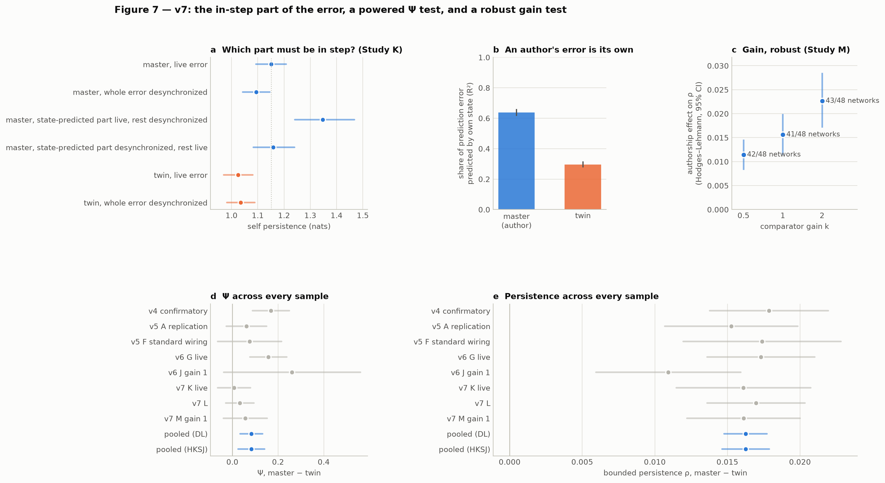

# Ghost in the Machine v7: An Author's Error Is Its Own

**Kai Piper**
27 September 2026

> **Scientific status.** Synthetic computational experiments. Nothing here creates, detects, measures or proves phenomenal consciousness in any system.

## Abstract

v6 showed that the authorship effect in this synthetic agent is carried by the comparator's prediction-error stream. When the agent authors its actions, the slowest collective mode of the comparator's target population is more persistent, and this depends on the error being in step with the network's own state. v7 asks what "in step" means, whether the effect scales with the comparator's coupling, and whether authorship-dependent causal emergence (Ψ) survives a test sized for it. Three studies (168 new networks, 720 runs) were preregistered and locked before any v7 data.

- **An author's error is largely its own.** A linear map of the network's current state predicts 64% of an author's prediction-error variance but only 30% of a twin's (d_z = 6.2).
- **Timing matters for the author, not the twin.** Desynchronizing the error again cost the author persistence (d_z = 0.53). It cost the twin nothing (−0.011 nats), and the difference was d_z = 0.66. This resolves an unexplained v6 observation.
- **Both parts of the error matter, and they interact.** The error was split into the part the state predicts ("feedback") and the rest ("innovation"). The preregistered decision is "both": each part, put back in step alone, raises persistence above the fully desynchronized condition. They are not additive:
  - With only the state-predicted part in step, persistence is 1.35 nats, well above the live run (1.15). The state-predicted part is a strongly stabilizing feedback loop.
  - With only the rest in step, persistence returns to the live level (1.16).
- **The effect grows with coupling.** With a bounded persistence measure and a rank-based test, the authorship effect is present at half comparator gain (42/48 networks) and grows with gain (38/48). v6's inconclusive gain study is resolved; its failure came from two networks whose near-frozen twins dominated a mean test on an unbounded measure.
- **Ψ does not replicate.** A preregistered test sized for the pooled v6 estimate (72 networks, about 92% power) failed (d_z = 0.12, p = 0.15, 41/72 networks). In the prespecified eight-sample meta-analysis (360 networks), the pooled Ψ effect halves to +0.083 (HKSJ 95% CI [0.025, 0.141]), with I² = 0.56 and a prediction interval that includes zero. The v6 revision to "modest and variable" was itself too generous.
- **The persistence effect** is as consistent as a synthetic result can be: +0.139 nats over eight samples, I² = 0, and 320 of 360 networks.

## 1. Questions

v6 left four questions.

1. The live error, `m_t = obs_t − f(x_t, intention_t)`, depends on the network's current state, so the comparator is also a feedback loop. Is the in-step benefit the loop, or the alignment of the rest?
2. A twin given the author's stream reached 0.85 of the effect, while the author given its own desynchronized stream reached only 0.60. Does synchrony matter only for the author?
3. Ψ: the v6 post-hoc pooled estimate was positive (d_z ≈ 0.36), but no single preregistered sample had been sized for it.
4. The comparator-gain study (v6 J) was inconclusive because of two outlying networks.

## 2. Methods

### 2.1 Splitting the prediction error

For each master, the mismatch at cycle t is regressed on the network state entering cycle t over its live analysis window, using ridge regression with a penalty of 10⁻³ times the mean eigenvalue of the state covariance. This gives:
- a **state-predicted part** `f_t = c + B x_t`;
- the **rest** `i_t = m_t − f_t`.

`src/ghost_v7/engine.py` mirrors v6 and is bit-identical to it at default settings. From the start of the analysis window it can compute either part live while the other is replaced by its own recorded stream, circularly shifted by half the window as in v6. With both parts live it reproduces the live run (unit tests). A live state-predicted part is a genuine closed loop: `W_cmp (c + B x_t)` is recomputed from the current state at every cycle.

### 2.2 A bounded measure and a rank-based test

v6's Gaussian persistence, I = −½ log(1 − ρ²), is unbounded as the lag-1 autocorrelation ρ approaches 1. v7 therefore adds ρ itself, the lag-1 autocorrelation of the same slowest mode. It is the exact bounded form of the Gaussian measure, verified to within 10⁻⁹. v7 also adds a Wilcoxon signed-rank test, computed by sign-flipping ranks, and Hodges–Lehmann estimates. Both were preregistered for L2, M1 and M2.

### 2.3 Studies

| study | networks | design | primary tests |
|---|---|---|---|
| **K** feedback vs innovation | 48 new (13000–13047), 4 new worlds | master: live · both parts desynchronized ("shift") · state-predicted part live, rest desynchronized · state-predicted part desynchronized, rest live. Twin: live · desynchronized | K1 live > shift · K2 state-predicted-live > shift · K3 rest-live > shift · K4 (master live − shift) − (twin live − shift) > 0 |
| **L** powered Ψ | 72 new (14000–14071), 4 new worlds | master vs cross-yoked twin | L1 Ψ master > twin (mean test) · L2 ρ master > twin (signed-rank) |
| **M** gain, robust | 48 new (15000–15047), 4 new worlds | master and twin at comparator gain 0.5, 1 and 2 | M1 effect at gain 0.5 > 0 · M2 effect(2) − effect(0.5) > 0 (both ρ, signed-rank) |

The decision rule for K, fixed in advance:
- "both" if K2 and K3 are significant;
- "feedback" if only K2 is significant and K3 is equivalent to zero;
- "innovation" if the reverse;
- otherwise "undetermined".

The cumulative meta-analysis was prespecified as exploratory. Its sample list (all eight default-contrast samples), random-effects pooling with the Hartung–Knapp–Sidik–Jonkman interval, leave-one-out estimates and prediction interval were all fixed before any v7 data.

### 2.4 Process

1. The hypotheses were committed and pushed before any v7 data (`3731203`).
2. A technical pilot on six development networks found no software faults. It did show that both split conditions exceeded the live run. This was recorded in the preregistration, and nothing was changed.
3. The lock was pushed (`22002fd`) before the confirmatory run. The results are in `ddaad5a`.

## 3. Results

### 3.1 Study K: which part must be in step?

| | mean diff [95% CI] | d_z | p (Holm) | robust: HL on ρ, positive networks, p |
|---|---|---|---|---|
| K1 desynchronization costs the author | +0.057 [0.027, 0.087] | 0.53 | < 0.001 | 0.0058, 33/48, 0.002 |
| K2 state-predicted part live restores | +0.253 [0.161, 0.361] | 0.70 | < 0.001 | 0.0153, 42/48, < 0.001 |
| K3 rest live restores | +0.065 [0.009, 0.136] | 0.28 | 0.018 | 0.0021, 27/48, 0.09 |
| K4 synchrony matters more for the author | +0.067 [0.039, 0.096] | 0.66 | < 0.001 | 0.0071, 35/48, < 0.001 |

**Preregistered decision: both.** K3 is the weakest result: it is significant in the mean test but not in the robust test.

| condition | self persistence (nats) [95% CI] | injected RMS |
|---|---|---|
| master, live error | 1.151 [1.093, 1.208] | 0.182 |
| master, both parts desynchronized | 1.094 [1.042, 1.146] | 0.182 |
| master, state-predicted part live, rest desynchronized | **1.348** [1.240, 1.468] | 0.225 |
| master, state-predicted part desynchronized, rest live | 1.159 [1.083, 1.240] | 0.195 |
| twin, live error | 1.025 [0.970, 1.080] | 0.261 |
| twin, both parts desynchronized | 1.035 [0.982, 1.089] | 0.261 |

**The two parts interact** (descriptive, not a preregistered test). Putting either part back in step removes the cost of desynchronization, and putting both back adds nothing beyond one:
- With only the rest in step, persistence returns to the live level.
- With only the state-predicted part in step, persistence rises well above the live run, even though more error is injected (RMS 0.225 against 0.182).

So the state-predicted part, on its own, acts as a strongly stabilizing feedback loop. In the live error, the in-step remainder partly counteracts it.

**An author's error is its own.** The state predicts 0.64 [0.62, 0.66] of the author's error variance and 0.30 [0.28, 0.31] of the twin's. Study L replicates the difference (d_z = 5.5).

**Synchrony matters for the author only.** Desynchronizing the twin's error cost it nothing (−0.011 nats, p = 0.17). This explains v6's observation: a twin has no in-step benefit to lose.

### 3.2 Study L: a powered test of Ψ

| | estimate [95% CI] | d_z | p (Holm) |
|---|---|---|---|
| L1 Ψ master > twin | mean +0.032 [−0.030, 0.093] | 0.12 | 0.15, **not supported** |
| L2 bounded persistence master > twin | HL +0.016 [0.013, 0.020]; 66/72 networks | 1.16 | < 0.001 |

The Ψ test is also not equivalent to zero (bound ±0.056; 90% CI [−0.020, 0.083]), so a small effect cannot be excluded.

Both terms of Ψ rise with authorship: the macro self-information by +0.158 and the parts' information by +0.126 (d_z = 0.46). Because they rise together, Ψ, their difference, barely moves. The collective mode becomes more predictable, and so does its relation to its parts.

### 3.3 Study M: comparator gain

| | Hodges–Lehmann on ρ [95% CI] | positive networks | d_z | p (Holm) |
|---|---|---|---|---|
| M1 effect at half gain | +0.0114 [0.0084, 0.0147] | 42/48 | 1.07 | < 0.001 |
| M2 effect grows from gain 0.5 to 2 | +0.0114 [0.0072, 0.0159] | 38/48 | 0.68 | < 0.001 |

The effect on ρ was +0.011, +0.016 and +0.023 at gains 0.5, 1 and 2 (41–43 of 48 networks positive at each). The mean-based Gaussian versions agree (+0.135, +0.144, +0.152 nats). Raising the gain lowered persistence in master and twin alike, the twin more steeply.

### 3.4 All v7 primary tests

Holm-corrected across all eight v7 primary tests, seven are significant. L1 (Ψ) is not.

### 3.5 Cumulative meta-analysis (prespecified, exploratory)

| | pooled master − twin | HKSJ 95% CI | I² | 95% prediction interval | networks positive |
|---|---|---|---|---|---|
| self persistence (nats) | +0.139 | [0.125, 0.153] | 0.00 | [0.123, 0.155] | 320/360 |
| bounded persistence ρ | +0.016 | [0.015, 0.018] | 0.00 | [0.014, 0.018] | 320/360 |
| Ψ | +0.083 | [0.025, 0.141] | 0.56 | [−0.057, 0.223] | 232/360 |

**Persistence:** the eight samples agree to within sampling error. Leave-one-out estimates range from 0.134 to 0.142. On the bounded scale, v6 J's two outlying networks no longer stand out.

**Ψ:** the estimate declined as samples accumulated: 0.168 (v4), 0.061, 0.075, 0.157, 0.261, 0.008, 0.032 and 0.056. The two early significant samples overestimated it.

## 4. Discussion

### 4.1 The mechanism so far

Across v4–v7:
- The comparator injects the agent's prediction error into its target population.
- When the agent authors its actions, that error is mostly something the network's own state already predicts. Its state-predicted part then acts as a stabilizing feedback loop through the comparator.
- A non-author's error is mostly unpredictable from its state (70% of the variance), so it acts more like external noise.

That explains every observation so far:
- the effect travels with the error stream (v6);
- desynchronizing an author's error costs persistence, but desynchronizing a twin's does not (v6, v7);
- the effect is online and follows the comparator's wiring (v5);
- it grows with coupling (v7);
- it scales smoothly with the fraction of self-authored actions (v5, v6).

In the language of the comparator model, self-generated consequences are predicted. The stabilizing term is not the prediction itself but the error's dependence on the agent's own state, which is what makes it the agent's own.

### 4.2 What the programme retracted

Over eight samples, the programme has now retracted or failed to replicate three of its most striking claims:
- v3's emergent-self event;
- the self population as special;
- authorship-dependent causal emergence.

Its least glamorous claim, that authorship stabilizes the slow dynamics of the comparator's target, is the one that holds without exception.

The Ψ history is also a methodological lesson.
- A single preregistered sample (v4) passed.
- A replication missed.
- A post-hoc pool (v6) seemed to rescue it.
- A powered, preregistered test (v7) did not.

Each step followed the evidence available at the time. The error was treating the post-hoc pool as a revision rather than a hypothesis. v7 treated it as a hypothesis and tested it.

### 4.3 Limitations

- The same analyst ran every study. Independent replication remains the most important missing step.
- The state-predicted part is defined by a linear ridge map. A nonlinear predictor might assign more of the error to the state.
- The interaction in Section 3.1 is descriptive. Its mechanism (why the in-step remainder partly counteracts the loop) is a hypothesis.
- ρ is a transform of the same statistic, not an independent measure. It fixes the unboundedness, not the choice of slow mode.
- All results concern one model family.

### 4.4 Next

1. Test the loop directly: inject only `W_cmp B x_t` (no error at all) into a twin. Does a pure self-feedback loop make a non-author look like an author?
2. Use a nonlinear state predictor to bound how much of an author's error is its own.
3. Independent external replication with the locked code.

## Data, code and preregistration

- Hypotheses before data: `3731203`. Lock: `prereg/PREREGISTRATION_v7.lock.json` (commit `22002fd`, pushed before the confirmatory run). Results: `ddaad5a`.
- Code: `src/ghost_v7/` (entry point `src/ghost_in_the_machine_v7.py`), building on the frozen v4–v6 packages. The meta-analysis is in `src/ghost_v7/meta.py`.
- Results: `results/v7/results_v7.json`, `results/v7/SUMMARY_v7.md`, coded runs in `results/v7/{K,L,M}/`, and the technical pilot in `results/v7_pilot/`.
- Reproduce: run the `run --study all`, `analyze` and `report` commands of `src/ghost_in_the_machine_v7.py` (about 15 minutes on 4 cores).
- Claims: `claims/claims.json`, `docs/CLAIMS.md` and the explorer `docs/index.html`, checked by `python tools/claims.py check`.
